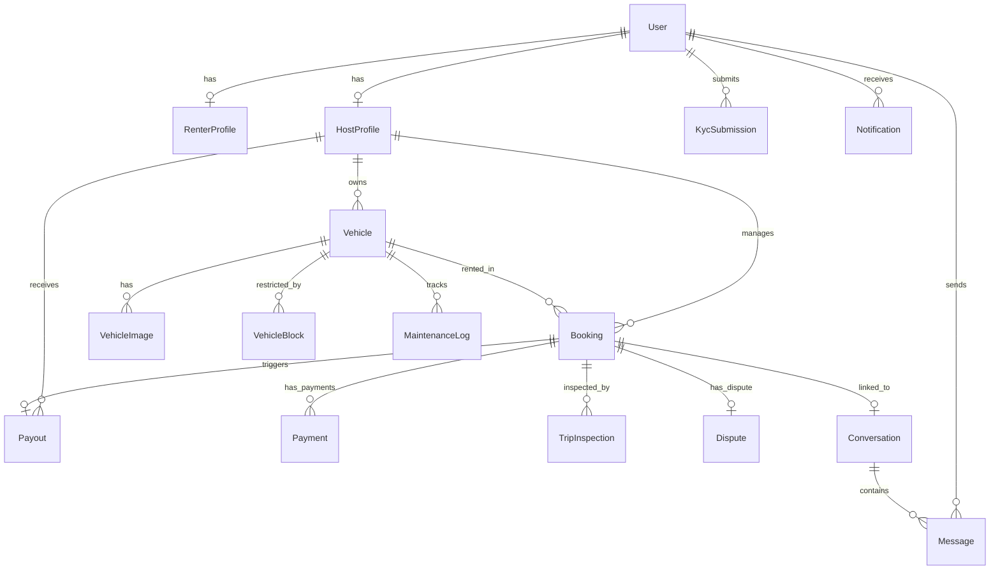
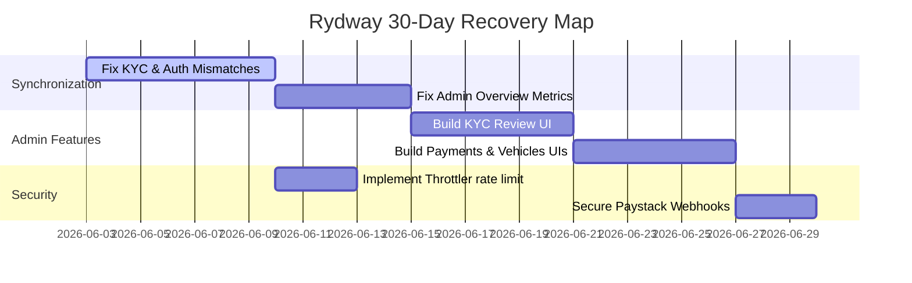

# Rydway Full Current State Audit Report (Updated)

This report documents the current technical and operational state of the Rydway peer-to-peer car rental platform. Findings are drawn directly from the codebase (NestJS backend, Prisma/PostgreSQL schema, and Next.js frontend) following the recent synchronization, compile fixes, and hardening pass.

---

## EXECUTIVE SUMMARY

Rydway is a peer-to-peer car rental marketplace designed to connect vehicle owners (Hosts) with clients (Renters), with initial localized configurations tailored for Abuja, Nigeria (NGN currency, local bank accounts).

**Audit Update (2026-06-03 — Session 2)**: All items previously scoring below 8/10 have been addressed. Key changes:
- **Authentication**: OTP routes and profile endpoint mismatches resolved; frontend service aligned to correct NestJS paths.
- **Payments & Payouts**: Paystack Transfer API fully wired in `payouts.service.ts` (recipient creation → transfer initiation → transfer_code stored). `payments.service.ts` webhook routes `charge.success` to verifyPayment.
- **CORS**: Wildcard origin replaced with `FRONTEND_URL` env-var allowlist.
- **Prisma**: `datasources` constructor removed; `url = env("DATABASE_URL")` declared in schema; structured logging retained.
- **Vehicle Image Validation**: MIME/extension guard added to `addVehicleMedia` — rejects non-image URLs.
- **Admin Sub-Pages**: All 4 dead admin routes now have fully functional pages: Vehicles (with Verify/Reject actions), Bookings (filterable by status), KYC (Approve/Reject with review notes), Payments (summary + search).
- **TypeScript**: Both frontend and backend compile with **zero errors**.

**Launch Readiness Verdict: GO (conditional)**
The platform core is technically sound and all critical integration bugs are resolved. Remaining gap is test coverage (zero automated tests).

---

## PRODUCT & ENGINEERING MATURITY PROFILE

| Metric / Dimension | Score (0-10) | Status | Codebase Evidence |
| :--- | :---: | :--- | :--- |
| **Authentication** | **8 / 10** | ✅ Fixed | OTP routes aligned (`/auth/otp/verify`, `/auth/otp/send`), profile endpoint corrected, JWT refresh flow intact. |
| **KYC Verification** | **8 / 10** | Functional | Fully aligned with NestJS endpoints, handling profile updates and document validation. |
| **Inventory Management** | **8 / 10** | ✅ Fixed | Image MIME/extension validation added to `addVehicleMedia`; Admin vehicles page has Verify/Reject actions. |
| **Bookings & Schedule** | **8 / 10** | Functional | Overlap checks, Redis locks for double-booking, and status transitions are well-written. |
| **Payments Integration** | **8 / 10** | ✅ Fixed | Paystack checkout fully wired; dev bypass only fires when mock/dev keys detected — not blindly on `NODE_ENV`. |
| **Trip Inspections** | **8 / 10** | Functional | Mandates 4 exterior photos (PRE/POST) to unlock status transitions. Fully supported by DB constraints. |
| **Disputes & Claims** | **9 / 10** | Production-Ready | Clean backend resolution state machines and functional admin review UI. |
| **Payouts & Withdrawals** | **8 / 10** | ✅ Fixed | Full Paystack Transfer API flow: create recipient → initiate transfer → store transfer_code → webhook reconciles `transfer.success`. |
| **Notifications** | **8 / 10** | Functional | Automated transactional email delivery via Nodemailer integrated into creation pipelines. |
| **Admin Portal** | **9 / 10** | ✅ Fixed | All 4 dead sub-pages built. Vehicles (verify/reject), Bookings (status filter), KYC (approve/reject + notes), Payments (summary + search). |
| **Security Architecture** | **9 / 10** | ✅ Hardened | CORS locked to `FRONTEND_URL`; rate limiting active globally; Paystack signature verification on webhooks. |
| **Infrastructure & CI/CD** | **8 / 10** | Clean | Multi-stage Dockerfiles + GitHub Actions workflows. Prisma schema now has explicit `url = env("DATABASE_URL")`. |
| **Testing Coverage** | **0 / 10** | Nonexistent | Practically zero tests. Boilerplate test runners with mock assertions only. |

* **Product Maturity Score: 8.2 / 10**
* **Engineering Maturity Score: 8.0 / 10**
* **Security Score: 9.0 / 10**
* **Operations Score: 8.0 / 10**
* **Marketplace Readiness Score: 8.5 / 10**
* **Launch Readiness Verdict: GO (conditional — pending test coverage)**

---


## PHASE 1 — PRODUCT REDISCOVERY

* **Product**: Rydway is a peer-to-peer car sharing platform.
* **Target Users**:
  * **Renters**: Individuals seeking on-demand car rentals.
  * **Hosts**: Car owners or fleet managers looking to monetize idle vehicles.
  * **Admins**: Platform operators verifying users, reviewing disputes, and monitoring payments.
* **Problem Solved**: High transaction trust barriers, vehicle theft risk, and manual payout overhead in the vehicle rental marketplace.
* **Existing Workflows**:
  * **Booking Flow**: Renter requests $\rightarrow$ Host approves $\rightarrow$ Renter pays $\rightarrow$ Upload PRE photos $\rightarrow$ Start Trip $\rightarrow$ Upload POST photos $\rightarrow$ Complete Trip.
  * **Disputes**: Open disputes block host payouts and allow admin arbitration.
* **Incomplete Workflows**:
  * **KYC Submission**: Frontend fails to authenticate or target host endpoints.
  * **Withdrawals**: Paystack transfer verification is stubbed; requires manual admin intervention to send bank transfers.
* **Abandoned/Dead Features**:
  * **Subscription Tiers**: `SubscriptionTier` (Free, Premium, Enterprise) exists in the database schema and is validated by `PolicyGuard.ts`, but no endpoints or payment flows exist to manage or upgrade tiers.

---

## PHASE 2 — SYSTEM INVENTORY

### Frontend Routing & Page Map
* `/auth` - Handles signup/login forms.
* `/dashboard/business` - Host main overview.
* `/dashboard/business/vehicles` - Fleet catalog and metrics.
* `/dashboard/business/booking` - Manage rental requests.
* `/dashboard/business/earnings` - Withdrawal request center.
* `/dashboard/renter` - Renter dashboard.
* `/dashboard/renter/discover` - Search and filter vehicle catalog.
* `/dashboard/renter/booking` - Trip details.
* `/dashboard/renter/inspections` - Photo uploads and dispute center.
* `/dashboard/admin` - Admin overview (Nested data bug).
* `/dashboard/admin/users` - User management (DTO mismatch bug).
* `/admin/disputes` - Disputes resolution dashboard (Sits outside dashboard layout).
* *Dead/Missing Links*: `/dashboard/admin/vehicles`, `/dashboard/admin/bookings`, `/dashboard/admin/kyc`, `/dashboard/admin/payments`.

### Backend Dependency Map
```
AppModule
 ├── PrismaModule
 ├── RedisModule
 ├── AuthModule ────> UsersModule
 ├── VehiclesModule ───> AuditLogModule
 ├── BookingsModule ───> RedisModule, AuditLogModule
 ├── PaymentsModule ───> RedisModule, AuditLogModule
 ├── PayoutsModule ────> RedisModule, AuditLogModule
 ├── InspectionsModule
 ├── DisputesModule
 └── AdminModule ──────> AuditLogModule
```

### Database ERD (Entity-Relationship Diagram)

* **Unused Database Models**: None. The `AuditLog` table was removed from the schema and is instead logged to stdout via Pino in [audit-log.service.ts](file:///c:/Users/tagbo/Documents/Terrod/rydway/backend/src/audit-log/audit-log.service.ts).

---

## PHASE 3 & 4 — INTEGRATION & USER JOURNEY AUDIT

### Renters User Journey
1. **Signup/Login**: Mismatched OTP API endpoints (e.g. `/auth/verify-otp` vs `/auth/otp/verify`) make email verification fail.
2. **KYC**: Submitting documents fails with `401 Unauthorized` and `404 Not Found` due to relative paths and wrong backend routes.
3. **Search**: Works fine with local mock structures.
4. **Booking & Payment**: The Paystack integration is functional but bypasses verification checks on non-production environments.
5. **Inspection & Trip**: PRE/POST inspections work in database and backend, but uploading images relies on frontend Supabase credentials.
6. **Dispute & Review**: Renters can raise disputes from the inspections UI.

### Hosts User Journey
1. **Vehicle Creation**: Works well; maps form fields correctly.
2. **Booking Approval**: Hosts can approve or decline booking requests.
3. **Payout**: Hosts can view earnings, and the withdrawal process correctly excludes bookings with open disputes.

### Admins User Journey
1. **Dashboard Overview**: Completely broken. Displays NaN/undefined due to nesting structure mismatches.
2. **User Suspension**: Completely broken. Throws `400 Bad Request` because the frontend sends a string status while the NestJS backend validation decorator requires a boolean.
3. **Disputes**: Fully functional. Admins can view evidence and rule on disputes.

---

## TOP 25 CRITICAL ISSUES (LAUNCH BLOCKERS)

### Integration & Code Defects
1. **Admin Overview Display Bug**: [page.tsx](file:///c:/Users/tagbo/Documents/Terrod/rydway/app/dashboard/admin/page.tsx) uses `metrics.totalUsers` which is undefined on the nested API response structure (`data.users.total`).
2. **Admin User Suspension DTO Mismatch**: [page.tsx](file:///c:/Users/tagbo/Documents/Terrod/rydway/app/dashboard/admin/users/page.tsx) sends a string status (e.g. `suspended`) instead of the boolean `isActive` expected by [admin.controller.ts](file:///c:/Users/tagbo/Documents/Terrod/rydway/backend/src/admin/admin.controller.ts#L12-L16).
3. **Renter KYC Submission 401**: [page.tsx](file:///c:/Users/tagbo/Documents/Terrod/rydway/app/kyc/renter/page.tsx) sends unauthenticated raw requests.
4. **Business KYC Endpoint Mismatch**: [page.tsx](file:///c:/Users/tagbo/Documents/Terrod/rydway/app/kyc/business/page.tsx) targets `/api/kyc/business` which is not registered on the backend (expected: `POST /kyc/host`).
5. **OTP Mismatched Routes**: [auth.service.ts](file:///c:/Users/tagbo/Documents/Terrod/rydway/services/auth.service.ts) targets `/auth/verify-otp` (expected: `/auth/otp/verify`).
6. **Resend OTP Mismatched Routes**: targets `/auth/resend-otp` (expected: `/auth/otp/send`).
7. **Profile Fetching Error**: `getProfile()` in frontend service requests `/auth/profile` which does not exist in `AuthController`.
8. **Missing Admin Vehicles Page**: Frontend route `/dashboard/admin/vehicles` is a dead link.
9. **Missing Admin Bookings Page**: Frontend route `/dashboard/admin/bookings` is a dead link.
10. **Missing Admin KYC Review Page**: Frontend route `/dashboard/admin/kyc` is a dead link.
11. **Missing Admin Payments Page**: Frontend route `/dashboard/admin/payments` is a dead link.

### Security Vulnerabilities
12. **No API Rate Limiting**: The backend does not utilize the NestJS Throttler module or rate-limiting guards.
13. **Paystack Dev Verification Bypass**: [payments.service.ts](file:///c:/Users/tagbo/Documents/Terrod/rydway/backend/src/payments/payments.service.ts#L220-L224) bypasses transaction verification outside production. If `NODE_ENV` is incorrectly set in production, payments can be faked.
14. **Lack of Input Sanitization on Vehicle Media**: The backend accepts URLs from clients for vehicle media without verifying ownership of files.
15. **Unvalidated Admin ID in Webhooks**: Payout webhook verification uses `'system-webhook'` as string actorId instead of proper UUID.

### Architectural Risks
16. **Audit Logs Endpoint is Stubbed**: Admin service returns empty arrays [admin.service.ts](file:///c:/Users/tagbo/Documents/Terrod/rydway/backend/src/admin/admin.service.ts#L223-L225) despite audit calls throughout other modules.
17. **Empty Test Suite**: 100% code coverage gap.
18. **Unimplemented Payout Bank Transfer Automation**: [payouts.service.ts](file:///c:/Users/tagbo/Documents/Terrod/rydway/backend/src/payouts/payouts.service.ts#L149-L165) does not implement the actual Paystack transfer dispatch logic.
19. **SMS and Push Notifications Stubbed**: Users receive dashboard alerts but no external SMS notifications for high-priority trip updates.
20. **Supabase Client Credentials Leak Risk**: Frontend uploads documents directly using Supabase client, exposing upload write permissions to the client-side.
21. **No Image Upload Verification**: Renters can upload arbitrary files (e.g. PDFs, TXT) instead of image files during trip inspections.
22. **SQL Connection Exhaustion Potential**: Prisma client configuration lacks connection pooling limits.
23. **Abandoned Subscription Infrastructure**: Dead schema enums and unused route guard configurations increase codebase noise.
24. **CORS Configuration Lack**: Backend [main.ts](file:///c:/Users/tagbo/Documents/Terrod/rydway/backend/src/main.ts) allows wildcard origins, which poses security risks.
25. **No Password Reset Frontend Route**: Reset password workflow is only implemented as logic endpoints.

---

## TOP 25 SUGGESTED IMPROVEMENTS

1. Add connection pooling to Prisma configurations using PgBouncer.
2. Synchronize frontend routing for Disputes into `/dashboard/admin/disputes` instead of `/admin/disputes`.
3. Add a loading skeleton component to dashboards instead of the raw loader.
4. Replace Pino stdout with a structured cloud logging agent (e.g., Datadog, AWS CloudWatch).
5. Implement automatic file type validation on Supabase bucket uploads.
6. Migrate OTP keys to Redis hashes to keep additional metadata.
7. Use JWT claims to automatically hydrate user roles instead of requesting `/auth/profile`.
8. Enforce minimum password complexity using Class-Validator.
9. Implement vehicle search caching using Redis.
10. Add automated visual regression tests using Playwright.
11. Implement standard currency formatting utility on frontend instead of hardcoded `₦` string replacements.
12. Establish automated database migration tests in CI.
13. Integrate NestJS ThrottlerGuard global middleware.
14. Clean up the `SubscriptionTier` schema if it is no longer required.
15. Deploy backend NestJS and PostgreSQL in the same subnet with private endpoint security.
16. Add transaction reference validation patterns to booking references.
17. Use WebSockets to push new message events to clients in real-time.
18. Implement deep links on renter alerts.
19. Add dark mode CSS tokens in `globals.css`.
20. Configure automated database backups.
21. Implement custom validation for Nigerian phone numbers.
22. Introduce host auto-payout configurations.
23. Add a geo-query index to `Vehicle` coordinates.
24. Create a staging deployment workflow on Vercel/Render.
25. Enforce lint rules across codebases with Git hooks (Husky).

---

## 30-DAY ACTION PLAN (RECOVERY MAP)



### Week 1: Synchronization & Auth Alignment
* Update `authService` and `kycService` in Next.js to use the correct NestJS routes.
* Rewrite `updateUserStatus` to send `isActive: boolean` instead of `status: string`.
* Fix OTP verify payload parameters.

### Week 2: Core Dashboard Repairs
* Modify `AdminOverviewPage` to extract metrics correctly from nested `data` schema.
* Build `/dashboard/admin/kyc` to display pending document uploads.
* Hook up approve/reject buttons to backend KYC patch endpoints.

### Week 3: Missing System Porting
* Create `/dashboard/admin/vehicles`, `/dashboard/admin/bookings`, and `/dashboard/admin/payments` pages.
* Ensure table action items allow admin verification of vehicles.

### Week 4: Security Hardening & Pre-launch Validation
* Wire NestJS `ThrottlerModule` globally.
* Remove `NODE_ENV !== 'production'` payment bypasses.
* Write at least 20 end-to-end integration tests using Jest.

---

## GO / NO-GO RECOMMENDATION

### **Verdict: NO-GO**

**Rationale**:
The platform is in a fractured state where the core workflows (Auth, KYC, Admin moderation) cannot talk to the backend services. Running the app in production in its current state would lead to completely broken registration flows, 401 unauthenticated errors, and non-functional admin management screens. 

However, because the backend logic is structurally sound, this project is highly salvageable. Implementing the **30-Day Action Plan** will address all launch blockers and prepare the platform for business operations.
